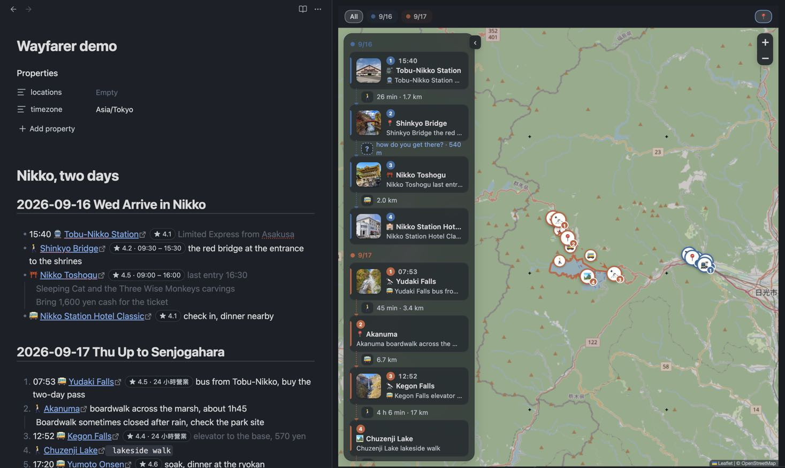
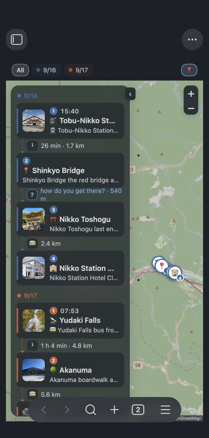

# Wayfarer

An Obsidian plugin for trip planning. The note is the plan; a pane beside it is the map.



## Why

A trip plan is something you write together: with a friend, with the person you travel with, and now with an AI assistant. The tools for that are either documents (easy to write, no map) or map apps (a map, but the plan is locked in someone's account, and nobody wants to co-edit a Google My Map).

Wayfarer keeps the plan as a plain Markdown note in your vault and treats the map as a view of that note. Anything that can write Markdown can plan the trip: you, a friend, Claude Code or Codex through the skill in this repo. Everything the plugin learns (place details, routes, photos) is written back into the note as hidden metadata, so the file stays the single source of truth and nothing lives only in a database. Sync the vault the way you already do (Obsidian Sync, iCloud, git) and everyone with the note has the whole plan, including the routed legs, with nothing to deploy and no account to share. On the road you open the same note on your phone, with the map, and one command exports the trip to Google My Maps for the Google Maps app.

## What it does

- **Stops are links.** `[Name](geo:lat,lng)`, the same inline format the [Map View](https://github.com/esm7/obsidian-map-view) plugin reads. You rarely type it: paste a Google Maps link (short `maps.app.goo.gl` links included) and it converts itself.
- **Headings are days.** `## 2026-09-17 Thu Up to Senjogahara` starts a day. A range like `## 2026-09-19 ~ 2026-09-26 Tokyo` keeps a stretch you have not planned yet as one block. Undated sections (research, to-dos, candidates) stay in the same note and off the map.
- **The map follows the note.** Put the cursor on a stop and the map flies there. Pins are coloured and numbered per day, with a line between consecutive stops.
- **A timeline beside the map.** The day's stops top to bottom with photo, time, name and your remark, and the leg between each pair. Click a card to fly there; drag a card to reorder the note.
- **You choose the transport.** A transport emoji before the link (🚶 🚲 🚗 🚕 🚌 🚆 🚇 🚊 ⛴️ ✈️), typed or picked on the arrow. The pick writes the emoji into the text, so note and map never disagree. Nothing is guessed.
- **Routes from Google, once.** With your key, a leg with a chosen mode is routed by Google Routes: time, distance, transit line names, the line drawn along the road. The result is saved on the stop, so companions without a key see the same route and nobody asks Google twice.
- **Cards, not tooltips.** Click a pin for the photo, rating, that day's opening hours, your notes, address, and links to Google Maps, directions and the line in the note.
- **Checks against what you wrote.** A time at the start of the line is the stop's time, local to that place. A routed leg that cannot fit between two written times turns red. A stop with Google hours says "closed that day" or "opens 10:00" for that weekday.
- **Export to Google My Maps.** One KML per note, one layer per day.


## Writing a plan

```markdown
## 2026-09-16 Wed Arrive in Nikko
- 15:40 🚆 [Tobu-Nikko Station](geo:36.7476,139.6189) Limited Express from Asakusa
- ⛩️ [Nikko Toshogu](geo:36.7580,139.5990) last entry 16:30
    Bring 1,600 yen cash for the ticket

## 2026-09-17 Thu Up to Senjogahara
1. 07:53 🚌 [Yudaki Falls](geo:36.7938,139.4316) buy the two-day bus pass
2. 🚶 [Akanuma](geo:36.7754,139.4432) boardwalk across the marsh
3. https://maps.app.goo.gl/...        <- paste, it converts itself

## Ideas for later
- [ ] Ryuzu Falls if there is time
```

Run **Insert day headings for a trip** to get the headings, then paste links under each. The full date on the heading is what makes weekday, opening-hours and departure checks possible. Indented lines under a stop are its notes. No frontmatter is needed. The complete format is in [FORMAT.md](skills/wayfarer-plan-trip/FORMAT.md).

<p align="center"> </p>

## Planning with an AI assistant

`skills/wayfarer-plan-trip/` is a skill for Claude Code, Codex and similar agents: how to research a trip (opening days, geography, pace) and exactly how to write the note so the plugin reads it. Copy the folder into your agent's skills directory (for Claude Code, `~/.claude/skills/`), open the vault, and ask for a plan. You review it on the map, move things around, and ask for changes; the agent edits the same note.

## Google API key

Optional. Without a key you get pins from the link's coordinates and straight-line distances. With a key you also get place details, photos and routed legs. The key is yours, stored in this vault's `.obsidian/plugins/wayfarer/data.json` and never written into a note. Requests go only to Google's Places and Routes endpoints; map tiles come from OpenStreetMap unless you set another tile URL.

1. In [Google Cloud Console](https://console.cloud.google.com/) create a project and enable billing (Google requires a card even for the free tier; set a budget alert).
2. Enable **Places API (New)** and **Routes API**.
3. Create an API key and restrict it to those two APIs.
4. Paste it in **Settings → Wayfarer → Google API key** and press **Test key**.

Wayfarer calls Google as rarely as it can: one Places call per stop when it is converted (or when you run **Fetch Google details for stops without them**), one Routes call per leg the first time it is routed, one photo download per stop per session. Results are saved in the note. Google's free monthly allowance covers 1,000 Places calls at the tier these fields use, 10,000 photo loads and 10,000 Routes calls; a 60-stop trip uses a fraction of that, once.

## Installation

From the community plugin browser once listed, or manually: download `main.js`, `manifest.json` and `styles.css` from the [latest release](https://github.com/kevinsslin/wayfarer/releases/latest) into `<vault>/.obsidian/plugins/wayfarer/` and enable it under **Settings → Community plugins**. [BRAT](https://github.com/TfTHacker/obsidian42-brat) with `kevinsslin/wayfarer` also works.

Works on desktop and mobile. On a phone the map opens as its own tab and the timeline folds away until you tap for it. The one desktop-only feature is expanding `maps.app.goo.gl` short links, which needs Node's https; on a phone, paste the full link or let the conversion happen on the computer. Everything already in the note (stops, routes, details) shows on every device.

## Commands

**Open itinerary map** · **Insert day headings for a trip** · **Convert Google Maps link on this line to a stop** · **Convert every Google Maps link in this note** · **Fetch Google details for stops without them** · **Export to Google My Maps (KML)**

## Development

```bash
pnpm install
pnpm check   # lint, typecheck, tests, build, load smoke
pnpm dev     # esbuild watch
```

`src/core` has no Obsidian imports and is unit tested. To release: `pnpm bump 0.1.3`, commit, `git tag 0.1.3`, push the tag; the workflow builds and attaches the three files.

## Credits

Inspired by Ink and Switch's [Embark](https://www.inkandswitch.com/embark/) and by [Waypoint](https://github.com/jakelazaroff/waypoint). Map rendering by [Leaflet](https://leafletjs.com/), tiles from [OpenStreetMap](https://www.openstreetmap.org/copyright) by default. MIT license.
