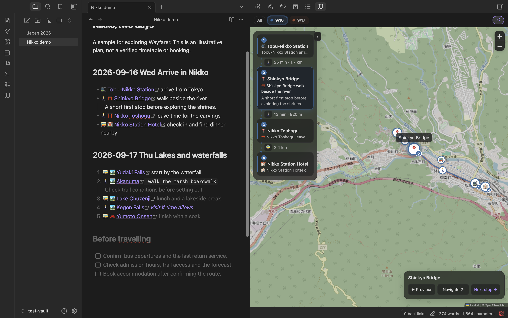
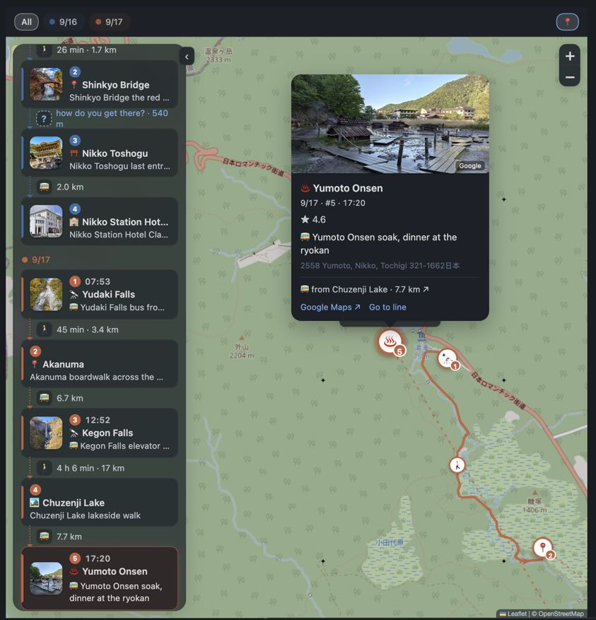
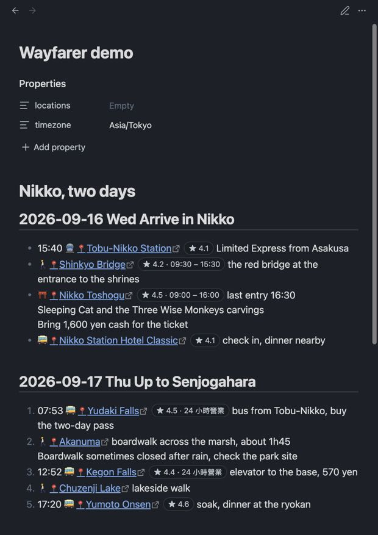
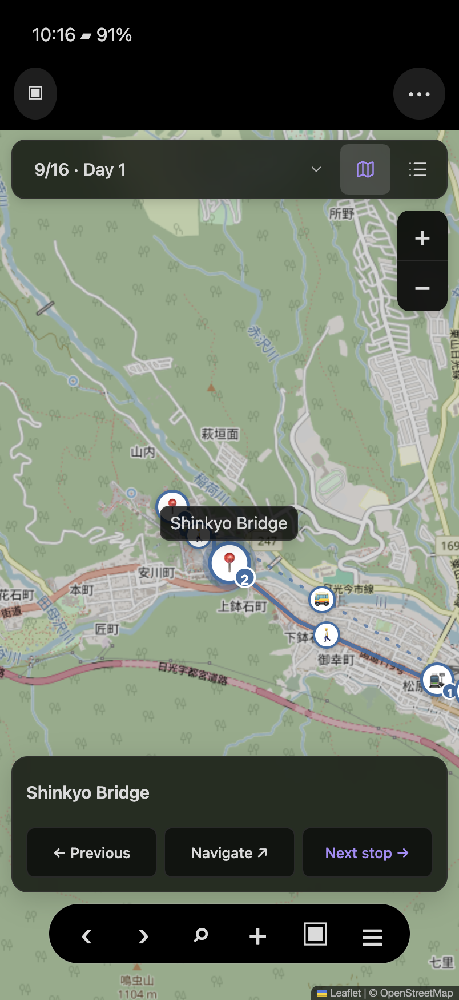
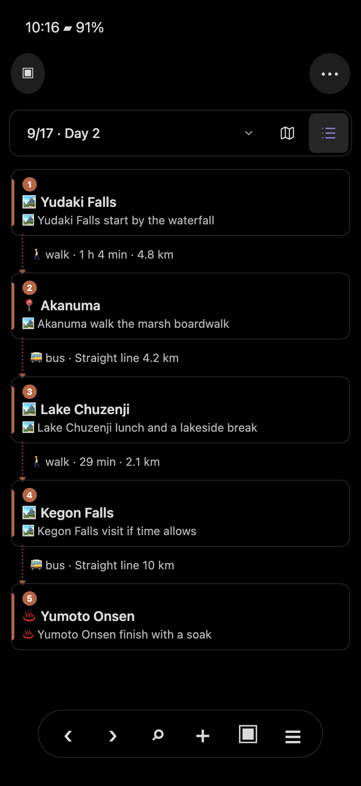

# Wayfarer

**Plan with your AI agent in Markdown. Follow your trip on a map, right from your phone.**

An Obsidian plugin with an optional AI planning skill and a mobile companion view.

[Install from the Obsidian directory](https://community.obsidian.md/plugins/wayfarer) · [Latest release](https://github.com/kevinsslin/wayfarer/releases/latest) · [Try the sample note](test-vault/Nikko%20demo.md)



## Why

A trip plan is something you write together: with a friend, with the person you travel with, and now with an AI assistant. The tools for that are either documents (easy to write, no map) or map apps (a map, but the plan is locked in someone's account, and nobody wants to co-edit a Google My Map).

Wayfarer keeps the plan as a plain Markdown note in your vault and treats the map as a view of that note. You, a friend, Claude Code or Codex can edit the same file. The bundled skill helps an AI assistant research a trip and write the itinerary, constraints, bookings and alternatives together.

Saved place details and routed legs travel with the note as hidden metadata. Sync it using your existing vault workflow, then open it on your phone to browse stops with Previous / Next or navigate to the selected place with Google Maps. Companions need Obsidian and Wayfarer to use the same map view; no Wayfarer account or hosted website is required. Map tiles and Google photos still need network access, and photo references in the note are not offline images. To share outside Obsidian, export a KML file and import it manually into Google My Maps.

## What it does

- **Stops are links.** `[Name](geo:lat,lng)`, the same inline format the [Map View](https://github.com/esm7/obsidian-map-view) plugin reads. You rarely type it: paste a full Google Maps place link and it converts to a stop. Short `maps.app.goo.gl` links can be expanded on desktop.
- **Headings are days.** `## 2026-09-17 Thu Up to Senjogahara` starts a day. A range like `## 2026-09-19 ~ 2026-09-26 Tokyo` keeps a stretch you have not planned yet as one block. Undated sections (research, to-dos, candidates) stay in the same note and off the map.
- **The map follows the note.** Put the cursor on a stop and the map flies there. Pins are coloured and numbered per day, with a line between consecutive stops.
- **A timeline beside the map.** The day's stops top to bottom with photo, time, name and your remark, and the leg between each pair. Click a card to fly there; drag a card to reorder the note.
- **You choose the transport.** A transport emoji before the link (🚶 🚲 🚗 🚕 🚌 🚆 🚇 🚊 ⛴️ ✈️), typed or picked on a desktop timeline arrow or in a stop’s **Change transport** menu. The pick writes the emoji into the text, so note and map never disagree. Nothing is guessed.
- **Saved Google routes.** With your key and a supported transport mode, Google Routes supplies time, distance, transit line names and route geometry. Saved routes can be read by companions without a key. Changing stops or transport can trigger new requests; flights and boats use straight-line connections.
- **Cards, not tooltips.** Click a pin for the photo, rating, that day's opening hours, your notes, address, and links to Google Maps, directions and the line in the note.
- **Checks against what you wrote.** A time at the start of the line is the stop's time, local to that place. A routed leg that cannot fit between two written times turns red. A stop with Google hours says "closed that day" or "opens 10:00" for that weekday.
- **Export to Google My Maps.** One KML per note, one layer per day.



## Writing a plan

```markdown
## 2026-09-16 Wed Arrive in Nikko
- 15:40 🚆 [Tobu-Nikko Station](geo:36.7476,139.6189) Limited Express from Asakusa
- ⛩️ [Nikko Toshogu](geo:36.7580,139.5990) last entry 16:30
    Bring 1,600 yen cash for the ticket

## 2026-09-17 Thu Up to Senjogahara
1. 07:53 🚌 [Yudaki Falls](geo:36.7938,139.4316) buy the two-day bus pass
2. 🚶 [Akanuma](geo:36.7754,139.4432) boardwalk across the marsh
3. https://maps.app.goo.gl/...        <- paste, it converts itself

## Ideas for later
- [ ] Ryuzu Falls if there is time
```

Run **Insert day headings for a trip** to get the headings, then paste links under each. The full date on the heading is what makes weekday, opening-hours and departure checks possible. Indented lines under a stop are its notes. No frontmatter is needed. The complete format is in [FORMAT.md](skills/wayfarer-plan-trip/FORMAT.md).



## Following the trip

On a phone, the date selector and **map / list icons** sit at the available top of the pane. The selected icon is highlighted; both have accessible names and generous tap targets. Controls leave room for Obsidian’s mobile header and bottom navigation. The desktop keeps its day chips and floating timeline.

The compact navigator shows the selected place, **Previous**, **Navigate** and **Next stop**. Previous and Next browse the note's stop order, including across days. Navigate opens Google Maps directions to the place you are looking at, from your device's location. Tap the place name for details. Selecting another date, map pin or list item changes what you browse; there is no separate current-trip progress, start/finish action or saved completion state.

The phone list is a dedicated reading surface with the navigator hidden. Select a stop to return to the map and its details. Transport legs show mode and duration or distance; a stop’s details include **Change transport**.

<p align="center"> </p>

These captures combine the real plugin renderer with reconstructed mobile host chrome using Obsidian’s CSS; they are not iOS/Android device screenshots. [Verification](docs/verification/0.1.9.md). [Desktop capture](docs/screenshots/mobile-navigation/desktop.png).

## Planning with an AI assistant

The repo ships a skill that teaches an agent to plan a trip the way this plugin expects: intake, research (hours, closed days, transport, coordinates), day structure, the note itself, and a to-do list at the top of it holding every bed, seat and ticket still unbooked. With it, Claude Code, Codex or any agent that reads skills produces a complete plan you then review on the map.

Install it once, from a terminal:

```bash
npx skills add kevinsslin/wayfarer
```

That works for Claude Code, Codex, Cursor and the other agents the `skills` CLI supports and asks which to install to. Claude Code users can instead add the repo as a plugin marketplace: `/plugin marketplace add kevinsslin/wayfarer` then `/plugin install wayfarer@wayfarer`. Or copy `skills/wayfarer-plan-trip/` by hand into your agent's skills folder (`~/.claude/skills/` for Claude Code, `~/.agents/skills/` for Codex).

Then open the vault in the agent and ask, for example: "Plan four days in Kyoto and Nara from 3 to 6 November for two, slow pace, one temple a day at most, we land at Kansai at 15:00." The agent writes `Kyoto 2026.md`; you open it beside the map, run **Convert every map link in this note** for any links it left, **Fetch Google details for stops without them** for hours and photos if you have a Google API key, choose transport, and ask the agent for changes. It edits the same note.

## Languages

| Part | Default and support |
|---|---|
| Map and trip controls | Follow Obsidian. English and Traditional Chinese are available; Chinese locales use Traditional Chinese and other unsupported locales fall back to English. Choose explicitly in **Settings → Wayfarer → Language**. |
| Settings, commands and some notices | Currently English; localization is not complete across the plugin. |
| Google place names and opening hours | Default to **Follow interface language**. With automatic interface language, Google requests follow Obsidian’s language, even if the map UI falls back to English. Choose English, Chinese, Japanese or another language independently under **Language for Google results** for future requests. Existing saved details are not automatically translated. Hours checks recognize a limited set of formats, so displaying another language does not guarantee its hours can be interpreted. |
| AI-written notes | The skill follows your requested language, preserves the language of existing notes, and uses English when a new note has no apparent language preference. Dates, coordinates and metadata keep the same format. |

Existing saved Google language preferences are preserved on upgrade, including the old `zh-TW` default. To opt in, select **Follow interface language**. Previous versions did not record whether a saved language was chosen explicitly.

The skill instructions and this README are written in English. Language support for AI output comes from your chosen assistant, not a built-in translation engine.

## Google API key

Optional. Without a key you get pins from the link's coordinates and straight-line distances. With a key you also get place details, photos and routed legs. The key is yours, stored in this vault's `.obsidian/plugins/wayfarer/data.json` and never written into a note. Requests go only to Google's Places and Routes endpoints; map tiles come from OpenStreetMap unless you set another tile URL.

1. In [Google Cloud Console](https://console.cloud.google.com/) create a project and enable billing (Google requires a card even for the free tier; set a budget alert).
2. Enable **Places API (New)** and **Routes API**.
3. Create an API key and restrict it to those two APIs.
4. Paste it in **Settings → Wayfarer → Google API key** and press **Test key**.

Wayfarer reuses saved details and routes to reduce requests. Changing stops or transport, fetching missing details and loading photos can make new requests. Google requires billing for these APIs; consult [current Google Maps Platform pricing](https://developers.google.com/maps/billing-and-pricing/pricing) for allowances and rates. Budget alerts notify you of spending; they do not cap it.

## Installation

In Obsidian, open **Settings → Community plugins → Browse**, search for **Wayfarer**, then install and enable it. You can also open the [directory listing](https://community.obsidian.md/plugins/wayfarer).

For manual installation, download `main.js`, `manifest.json` and `styles.css` from the [latest release](https://github.com/kevinsslin/wayfarer/releases/latest) into `<vault>/.obsidian/plugins/wayfarer/` and enable it under **Settings → Community plugins**. [BRAT](https://github.com/TfTHacker/obsidian42-brat) with `kevinsslin/wayfarer` also works.

Works on desktop and mobile. On a phone the map opens as its own tab and the timeline folds away until you tap for it. The one desktop-only feature is expanding `maps.app.goo.gl` short links, which needs Node's https; on a phone, paste the full link or let the conversion happen on the computer. Saved stops, routes and details can be read on desktop and mobile. Stop selection is for browsing and is not saved as travel progress.

## Commands

**Open itinerary map** · **Insert day headings for a trip** · **Convert the map link on this line to a stop** · **Convert every map link in this note** · **Fetch Google details for stops without them** · **Export the trip as a map file** (KML for Google My Maps)

## Development

```bash
pnpm install
pnpm check   # eslint, stylelint, typecheck, tests, build, load smoke
pnpm dev     # esbuild watch
```

`src/core` has no Obsidian imports and is unit tested. To release: `pnpm bump 0.1.3`, commit, `git tag 0.1.3`, push the tag; the workflow builds the three files, attests them (`gh attestation verify main.js --repo kevinsslin/wayfarer`) and attaches them to the release.

## Credits

Inspired by Ink and Switch's [Embark](https://www.inkandswitch.com/embark/) and by [Waypoint](https://github.com/jakelazaroff/waypoint). Map rendering by [Leaflet](https://leafletjs.com/), tiles from [OpenStreetMap](https://www.openstreetmap.org/copyright) by default. MIT license.
